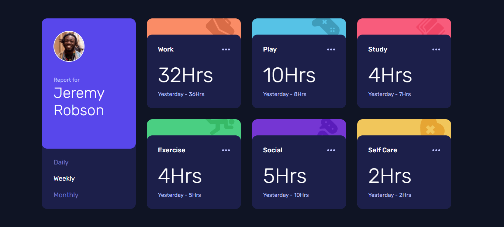
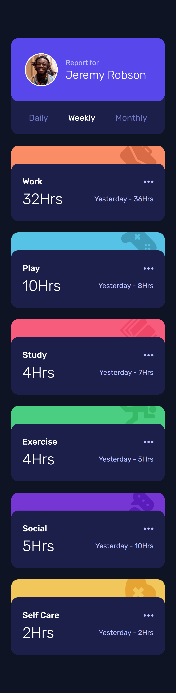

# Frontend Mentor - Time tracking dashboard solution

This is a solution to the [Time tracking dashboard challenge on Frontend Mentor](https://www.frontendmentor.io/challenges/time-tracking-dashboard-UIQ7167Jw). Frontend Mentor challenges help you improve your coding skills by building realistic projects. 

## Table of contents

- [Overview](#overview)
  - [The challenge](#the-challenge)
  - [Screenshot](#screenshot)
  - [Links](#links)
- [My process](#my-process)
  - [Built with](#built-with)
  - [Continued development](#continued-development)
- [Author](#author)

## Overview

### The challenge

Users should be able to:

- View the optimal layout for the site depending on their device's screen size
- See hover states for all interactive elements on the page
- Switch between viewing Daily, Weekly, and Monthly stats

### Screenshot

### Links

- Solution URL: (https://github.com/arbaiv/time-tracking-dashboard-challenge)
- Live Site URL: (https://naughty-lalande-1f310c.netlify.app)

## My process

### Built with

- Semantic HTML5 markup
- CSS custom properties
- Flexbox
- Mobile-first workflow
- JavaScript

### Continued development

I need to learn ES6 and build more projects to improve my JS skills.

## Author

- LinkedIn - [Abdur Rahaman](https://www.linkedin.com/in/abdur-rahaman-arb4/)
- Frontend Mentor - [@arbaiv](https://www.frontendmentor.io/profile/arbaiv)
- Github - [@arbaiv](https://github.com/arbaiv)
- Facebook - [Abdur Rahaman](https://www.facebook.com/people/Abdur-Rahaman/100052283355364/)
- Phone Number - [Country: Bangladesh](+8801775575562)

